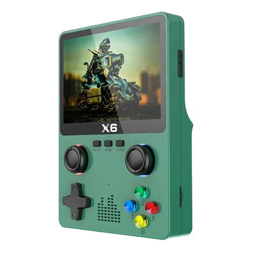

# How to Setup a new SD Card for the X6 Handheld
Guide on how to setup new SD card for the Console X6 Handheld.

> The [X6 Handheld](https://s.click.aliexpress.com/e/_DdW7ChL) is a cheap portable device sold mainly by *Data Frog* and has some surprisingly good GBA performance. The device usually comes with a very cheap and unreliable SD-Card and many people have had trouble when trying to create their own game libraries on a new SD Card and this guide aims to help you solve that.

1. Format your target SD Card as *Fat32* or *exFat* 
2. Plug your SD Card into the X6 device, power it on and wait for the **"Card In"** message
3. Navigate into the **Game** menu and wait for it to load. *Your device may freeze for a few seconds at this point but this is expected just wait for it to open the games menu*.
4. You should see a message saying that the device is empty or something like that. After that just go back into the main menu and power off your device.
5. Remove the SD Card from the device and insert it int your computer
6. Your device should already have a few folders that were created automatically by the X6
7. Download the [x6_apps_folder_backup.zip](https://github.com/itsadeadh2/console-x6-new-sd-setup/releases/tag/v1) file and extract it at the root of your sd card.
> Please note that **you are not required to use this apps folder**. If you still have access to the original SD-Card that came with your device you can just use grab the `apps` folder that came inside of it.
8. After extracting you should now see a new `apps` folder added in
9. Done! Now you can just populate the `games` folder with your own files. 

## PT-BR
1. Formate seu cartão SD de destino como *Fat32* ou *exFat*
2. Conecte o seu cartão SD no dispositivo X6, ligue-o e aguarde a mensagem **"Card In"**
3. Abra o menu **Games** e aguarde o carregamento. *Seu dispositivo pode travar por alguns segundos neste ponto, mas isso é esperado. Apenas aguarde até que o menu de jogos seja aberto.*
4. Você deverá ver uma mensagem informando que o dispositivo está vazio ou algo assim. Depois disso, volte ao menu principal e desligue o dispositivo.
5. Remova o cartão SD do dispositivo e insira-o no seu computador.
6. Seu dispositivo já deve ter algumas pastas criadas automaticamente pelo X6.
7. Baixe o arquivo [x6_apps_folder_backup.zip](https://github.com/itsadeadh2/console-x6-new-sd-setup/releases/tag/v1) e extraia-o na raiz do seu cartão SD.
> Tenha em mente que **voce não precisa usar essa pasta apps que eu estou disponibilizando**. Se voce ainda tiver seu cartão original que veio com seu X6 voce pode simplesmente usar a pasta `apps` que veio originalmente nele.
8. Após a extração, você deverá ver uma nova pasta chamada apps adicionada.
9. Pronto! Agora você pode preencher a pasta games com seus próprios arquivos.

Se esse guia te ajudou considere-se se inscrever no [meu canal de reviews](https://www.youtube.com/@newretrotech) 🤓
